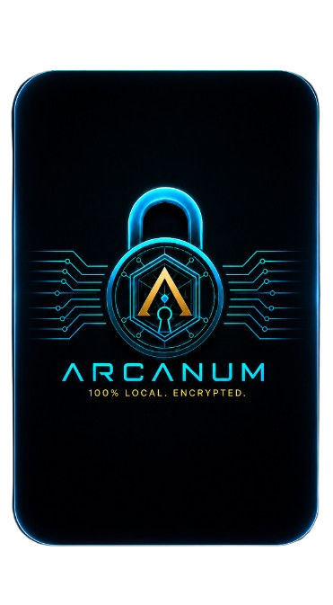

<p align="center">
  
</p>

<p align="center">
  
  
  
  
  
</p>

# Arcanum — Gerenciador de Senhas Pessoal

Gerenciador de senhas **100% local**.
Nenhum dado sensível sai do seu computador. Sem conta, sem servidor, sem assinatura — só você e um arquivo criptografado.

---

## Índice

1. [Requisitos e Instalação](#requisitos-e-instalação)
2. [Como usar](#como-usar)
3. [Funcionalidades](#funcionalidades)
4. [Documentação técnica](#documentação-técnica)
5. [Roadmap](#roadmap)

---

## Requisitos e Instalação

**Requisitos:**
- Windows 10 ou superior **ou** Linux (qualquer distro moderna com suporte a .NET 10)
- [.NET 10 SDK](https://dotnet.microsoft.com/download/dotnet/10.0) (para compilar) **ou** apenas o [.NET 10 Runtime](https://dotnet.microsoft.com/download/dotnet/10.0) (para rodar o binário compilado)

**1. Restaure os pacotes NuGet e compile:**
```bash
dotnet build
```

**2. Execute:**
```bash
dotnet run
```

Ou abra `Arcanum.csproj` no **Visual Studio 2022+** e pressione F5.

**3. Gere o binário standalone:**

Windows:
```bash
dotnet publish -c Release -r win-x64 --self-contained true -p:PublishSingleFile=true -p:IncludeNativeLibrariesForSelfExtract=true
```
O arquivo gerado estará em:
```
bin\Release\net10.0\win-x64\publish\Arcanum.exe
```

Linux:
```bash
dotnet publish -c Release -r linux-x64 --self-contained true -p:PublishSingleFile=true -p:IncludeNativeLibrariesForSelfExtract=true
```
O arquivo gerado estará em:
```
bin/Release/net10.0/linux-x64/publish/Arcanum
```

> **Aviso do Windows SmartScreen:** na primeira vez que abrir o `.exe`, o Windows vai exibir um aviso de segurança porque o arquivo não tem assinatura digital. Isso é normal para apps independentes sem certificado. Para continuar: clique em **"Mais informações"** → **"Executar assim mesmo"**.

---

## Verificação de integridade (opcional)

Antes de executar o binário, você pode confirmar que ele não foi corrompido ou substituído verificando o hash SHA-256. Os hashes oficiais estão no arquivo `SHA256SUMS` publicado junto com o release.

### Linux

**1.** Baixe os três arquivos do release para a mesma pasta:
- `Arcanum-linux-x64`
- `SHA256SUMS`
- `verificar.sh`

**2.** Abra o terminal na pasta onde baixou e rode:
```bash
bash verificar.sh ./Arcanum-linux-x64
```

**3.** Saída esperada:
```
✓ Binário íntegro — corresponde ao release oficial.
```

---

### Windows

**1.** Baixe `Arcanum-win-x64.exe` e `SHA256SUMS` do release.

**2.** Abra o PowerShell na pasta onde baixou e rode:
```powershell
Get-FileHash .\Arcanum-win-x64.exe -Algorithm SHA256
```

**3.** Compare o hash exibido com a segunda linha do arquivo `SHA256SUMS` (abra com o Bloco de Notas). Se forem iguais, o arquivo está íntegro.

---

> **Nota:** se você compilou o projeto do fonte, o hash será diferente do oficial — isso é esperado e não indica problema algum.

---

## Como usar

Compile e execute conforme acima, ou abra o `.exe` publicado diretamente.

### Primeiro acesso — criação do vault

> **Sobre desligar a internet (leia com honestidade):** alguns guias recomendam desconectar a internet ao criar o vault. Isso elimina um vetor específico: malware que captura a senha e exfiltra em tempo real pela rede. Na prática, porém, a maioria dos keyloggers armazena os dados localmente e envia quando a internet volta — então desligar a rede por 30 segundos não protege contra isso. Se sua máquina tem malware ativo, o problema é o sistema operacional, não o gerenciador de senhas. A medida real é manter o sistema limpo. Faça o que preferir — não é prejudicial, mas não cria segurança significativa além do que a criptografia do vault já garante.

Na tela de desbloqueio, defina uma senha mestre com **no mínimo 12 caracteres**, contendo letras, números e ao menos um símbolo. O app valida os requisitos em tempo real e exibe confirmação visual enquanto você digita.

#### Por que esses requisitos existem — e o risco de ignorá-los

A senha mestre é o **único ponto de falha** do sistema. O arquivo `.arcanum` pode ser copiado por qualquer pessoa — o que impede o acesso é exclusivamente a força da senha combinada com o Argon2id. Se a senha for fraca, o arquivo pode ser quebrado offline, sem limite de tentativas, no hardware do atacante.

**Espaço de busca para senhas de 12 caracteres:**

| Charset | Combinações possíveis | Tempo estimado¹ |
|---|---|---|
| Só números (10) | 10¹² ≈ 1 × 10¹² | **< 1 hora** |
| Só minúsculas (26) | 26¹² ≈ 9,5 × 10¹⁶ | **~2 semanas** |
| Maiúsculas + minúsculas (52) | 52¹² ≈ 3,9 × 10²⁰ | **~600 anos** |
| + números (62) | 62¹² ≈ 3,2 × 10²¹ | **~5.000 anos** |
| + símbolos — **requisito mínimo** (94) | 94¹² ≈ 4,7 × 10²³ | **~700.000 anos** |

> ¹ Estimativas para GPU moderna testando ~100 tentativas/segundo com Argon2id (64 MiB, 3 iterações). Metodologia adaptada do **Hive Systems Password Table 2024**.

**O que o Argon2id faz pela sua senha:**
Sem KDF dedicado, uma GPU moderna consegue bilhões de tentativas por segundo contra um hash simples (SHA-256, MD5). O Argon2id impõe 64 MiB de RAM por tentativa — isso fisicamente limita ataques de GPU a poucas dezenas de tentativas por segundo, tornando senhas com charset completo computacionalmente inviáveis de quebrar.

**Risco real se os requisitos forem ignorados:**
Uma senha como `senha123456` (12 chars, só minúsculas + números) cai na faixa de anos — não décadas. Com dicionários de senhas vazadas (ex: RockYou com 14 bilhões de entradas), senhas previsíveis podem ser quebradas em minutos mesmo com Argon2id.

**Referências:**
- [Hive Systems Password Table 2024](https://www.hivesystems.com/blog/are-your-passwords-in-the-green)
- [NIST SP 800-63B — Digital Identity Guidelines](https://pages.nist.gov/800-63-3/sp800-63b.html) — recomenda mínimo 15 chars para contas de alto valor
- [RFC 9106 — Argon2 Memory-Hard Function](https://www.rfc-editor.org/rfc/rfc9106)

---

Por padrão o vault é criado em `~/.arcanum/vault.arcanum`. Para usar outra localização — útil quando mais de uma pessoa compartilha o mesmo computador — use os botões **Abrir** (para selecionar um vault existente) ou **Novo** (para criar um vault em outro local). O app lembra o último caminho usado automaticamente.

O vault é criado em:

```
Windows:  C:\Users\<você>\.arcanum\vault.arcanum
Linux:    /home/<você>/.arcanum/vault.arcanum
```

### Uso diário — passo a passo

1. Abra o Arcanum — pelo atalho da área de trabalho ou pelo `.exe` diretamente
2. Digite a senha mestre → vault desbloqueia e a janela principal abre
3. **Painel esquerdo:** lista de entradas + busca em tempo real
4. **Painel direito:** formulário com detalhes da entrada selecionada

**Adicionar uma senha nova:**
- Clique em `+ Nova entrada`
- Preencha: Serviço (ex: "GitHub"), Login, URL e Senha
- Use `Gerar` para criar uma senha forte de 24 caracteres automaticamente
- Preencha o campo **TOTP Seed** se quiser guardar o segredo do autenticador (veja abaixo)
- Clique em `Aplicar` — salva e criptografa imediatamente no disco. O vault é salvo automaticamente a cada operação; não há botão de salvar separado

### O que é o campo TOTP Seed?

TOTP (Time-based One-Time Password) é o sistema por trás dos códigos de 6 dígitos que mudam a cada 30 segundos — o famoso "segundo fator" de apps como Google Authenticator, Authy e Microsoft Authenticator.

Quando você ativa o 2FA em um site, ele exibe um **QR code**. Por dentro, esse QR code é apenas uma string em formato Base32 — o **seed** (semente). O aplicativo autenticador grava esse seed e usa ele + o horário atual para calcular o código do momento.

**O Arcanum permite guardar esse seed junto com a senha da conta**, dentro do mesmo vault criptografado. Isso serve para duas coisas:

1. **Backup do 2FA** — se você perder o celular ou trocar de autenticador, o seed está aqui e você pode reconfigurar sem perder acesso à conta
2. **Geração integrada** — o app gera o código TOTP em tempo real (via `OtpNet`) direto na tela, com barra de progresso e botão copiar, sem precisar de celular

**Como pegar o seed de um site:**
- Na maioria dos sites, ao ativar o 2FA, há uma opção "não consigo escanear o QR code" ou "chave manual" — essa chave é o seed Base32 (ex: `JBSWY3DPEHPK3PXP`)
- Cole esse valor no campo TOTP Seed e clique em `Aplicar`
- O campo aceita apenas Base32 válido (letras A–Z e dígitos 2–7) — se o valor for inválido, o app avisa

> **O campo é completamente opcional.** Se você não usa 2FA ou prefere manter o seed só no autenticador, deixe em branco.

**Usar uma senha salva:**
- Clique na entrada na lista à esquerda
- Clique em `Copiar` — o clipboard é limpo automaticamente em **30 segundos**
- Use `Ver` para revelar a senha na tela se necessário

**Buscar:**
- Digite qualquer parte do serviço, login ou URL — filtra em tempo real

**Backup, sync e restauração:**

O vault é um único arquivo criptografado. Você decide onde ele fica — e isso é uma decisão de design intencional.

Essa é a mesma filosofia do **KeePass**, o gerenciador de senhas open source mais auditado do mundo: ele não tem sync nativo. O arquivo `.kdbx` é seu — você coloca onde quiser. Pendrive, Google Drive, Dropbox, OneDrive, e-mail, servidor pessoal. O app não sabe e não precisa saber onde o arquivo está.

**Por que isso é melhor do que sync automático integrado:**
- Você não depende de nenhum serviço externo — se o Google Drive sair do ar, suas senhas continuam acessíveis
- Nenhuma credencial de nuvem é gerenciada pelo app — sem surface de ataque adicional
- Você escolhe o nível de redundância: um pendrive, três nuvens, ou só local — decisão sua
- O arquivo é 100% portável: qualquer cópia dele, em qualquer lugar, abre com a senha mestre

```
Windows:  C:\Users\<você>\.arcanum\vault.arcanum
Linux:    /home/<você>/.arcanum/vault.arcanum
```

**Para sincronizar entre máquinas:** coloque o vault em uma pasta do Google Drive / Dropbox e use o botão **Abrir** para apontar o app para esse caminho. Sync automático, sem nenhum código extra.

Para **restaurar** ou **migrar de outra máquina**: substitua o arquivo acima pelo seu backup e abra o app normalmente.

### Acessos seguintes

Digite a senha mestre para desbloquear. Se a senha estiver errada ou o arquivo tiver sido adulterado, o sistema retorna a mesma mensagem genérica — sem dar pistas ao atacante sobre qual dos dois ocorreu.

> **IMPORTANTE:** a senha mestre nunca é salva em lugar nenhum. Se você esquecer, não há recuperação. O arquivo se torna permanentemente inacessível.

---

## Funcionalidades

| Funcionalidade | Descrição |
|---|---|
| Adicionar entrada | Serviço, login, senha, URL, observações, TOTP seed |
| Editar entrada | Selecione na lista e modifique os campos |
| Excluir entrada | Com confirmação antes de remover |
| Busca em tempo real | Filtra por serviço, login ou URL |
| Copiar senha | Auto-limpa o clipboard após 30 segundos |
| Ver / ocultar senha | Alterna visibilidade do campo senha e do TOTP seed |
| TOTP seed | Campo para guardar o segredo do autenticador 2FA; validado como Base32 |
| Gerar senha forte | 24 caracteres, `RandomNumberGenerator` (CSPRNG do .NET), sem caracteres ambíguos |
| Indicador de força | Barra colorida em tempo real ao digitar a senha (Fraca / Média / Forte) na tela de login e no formulário |
| Auto-save | Vault re-criptografado e gravado automaticamente a cada Aplicar / Excluir |
| Auto-lock | Trava e volta à tela de login por inatividade — configurável via "Auto-lock:" (30s / 1min / 5min / 15min / 30min / Nunca), salvo automaticamente |
| Proteção de fechamento | Aviso ao fechar a janela com alterações não aplicadas |
| Seletor de vault | Dois botões dedicados: **Abrir** (abre vault existente) e **Novo** (cria vault em outro local) — ideal para múltiplos usuários no mesmo PC; último caminho lembrado automaticamente |
| Regras de senha mestre | Exige mínimo 12 caracteres com letras, números e símbolo; confirmação com feedback verde/vermelho em tempo real |
| Trocar senha mestre | Troca a senha sem perder dados — vault re-criptografado do zero com novo salt e nonce; exige confirmação da senha atual |
| URL clicável | Botão 🌐 ao lado do campo URL abre no navegador padrão (somente http/https) |
| Avatar na lista | Círculo colorido com a inicial do serviço — cor determinística por nome, consistente entre sessões |

---

## Documentação técnica

- [Como o sistema funciona por dentro](docs/como-funciona.md) — criptografia, formato `.arcanum`, gerador de senhas, "é possível burlar?"
- [Arquitetura de Segurança](docs/seguranca.md) — primitivas criptográficas, formato binário, catálogo de vulnerabilidades V1–V11
- [Estrutura do Projeto e Dependências](docs/arquitetura.md) — organização do código, NuGet packages, notas para desenvolvedores
- [Instalação no Linux](docs/manual-linux.md) — guia passo a passo + script de instalação para Linux Mint, Ubuntu e derivados

---

## Roadmap

- [x] Fase 1 — Base funcional: vault criptografado, UI Avalonia dark, gerador de senhas, TOTP live
- [x] Fase 2 — Identidade visual: paleta preto + vermelho sangue, layout duas colunas no UnlockWindow, padronização de botões, auto-lock configurável, indicador de força da senha
- [ ] Fase 3 — Polish avançado: animações, transições, MainWindow 3 colunas
- [ ] Fase 4 — Auditoria de senhas fracas ou reutilizadas (comparação de hashes internos)
- [ ] Fase 5 — Padding do ciphertext para ocultar tamanho exato do vault (V8)
- [ ] Fase 6 — `VirtualLock()` para fixar páginas sensíveis na RAM (V6)
- [ ] Fase 7 — `byte[]` + `ZeroMemory` para campos sensíveis internos em vez de `string` (V11)
